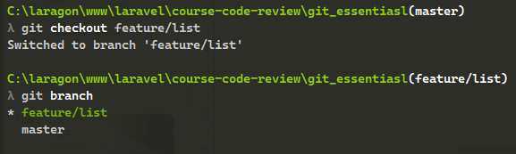
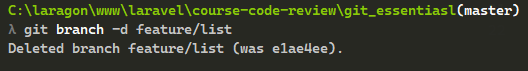

# Capitulo 1: GIT

## Objetivo

* Crear un repositorio desde cero y aplicar los comandos basicos, como el commit, crear ramas y merge

## Instrucciones

1. Tener configurado la informacion de usuario

Tener en cuenta que el email sea el mismo en caso de manejar cuenta de github

2. en una carpeta creamos un archivo html, en este se podria unicamente establecer una estructura html basica

3. Por medio de la terminal inicializar el repositorio

4.  con el siguiente comando podemos visualizar que git ya esta haciendo seguimiento a nuestro archivos.

5. Con el siguiente comando agregaremos el archivo al area de stage para hacer commit

6. Usando status se podra verificar que ya no esta el archivo en el registro de cambios pendientes

7. Proceder a realizar commit despues de agregar el archivo al stage

8. Ahora procedemos a crear una rama y verificamos que halla hecho correctamente

9. cambiamos a la rama creada y modificamos el html con una lista o otro contenido

10. agregamos los cambios al area de stage y hacemos commit del cambio

11. cambiamos a la rama master y hacemos merge con la rama creada anteriormente

12. despues de unificados los cambios eliminamos la rama anteriormente creada

13. una vez eliminada podemos podemos verificar que los cambios aun percisten, lo que significa que todo el proceso fue realizado de forma corracta

