# Capitulo 2: Repositorio remoto con Github Desktop

## Objetivo

* Tomar el repositorio creado en local y subirlo al repositorio remoto en github con ayuda de Github Desktop y gestionarlo

## Tiempo Aproximado: 20 mins

## Instrucciones

1. Conectar nuestra cuenta de github con la version de escritorio

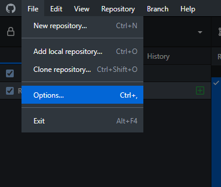

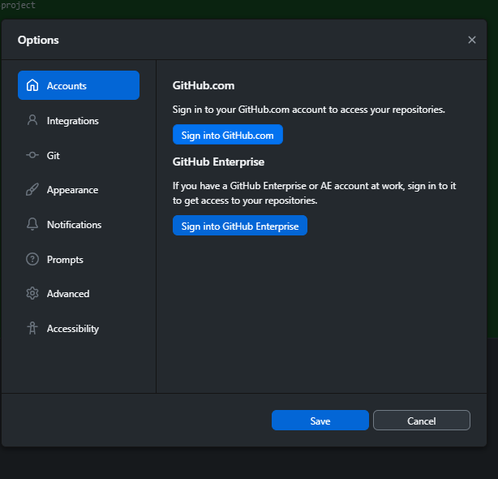

Seleccionamos la opcion "Sign into Github.com" esto nos abrira el navegador

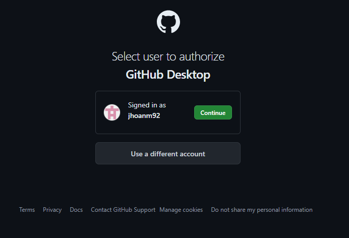

Aqui si no hemos iniciado sesion, nos pedira que lo hagamos, finalmente damos a "Continue"

2. Ingresamos a la opcion "Add existing repository"

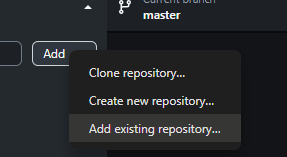

3. Buscamos la ubicacion de la carpeta en la cual inicializamoes el repositorio damos a "Add repository".

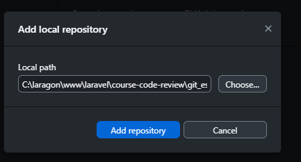

4.  Ahora en el listado de repositorios podemos ver que nuestro repositorio fue agregado a la herramienta de forma correcta.

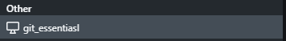

5. En la parte superior encontraremos la opcion de "Publish repository" damos click, esto creara el repositorio en nuestra cuenta de github

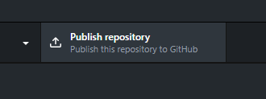

6. Despues debes llenar la informacion que se nos solicita, nombre, descripcion y escoger el tipo de visualizacion, publico o privado y damos click a "Publish repository"

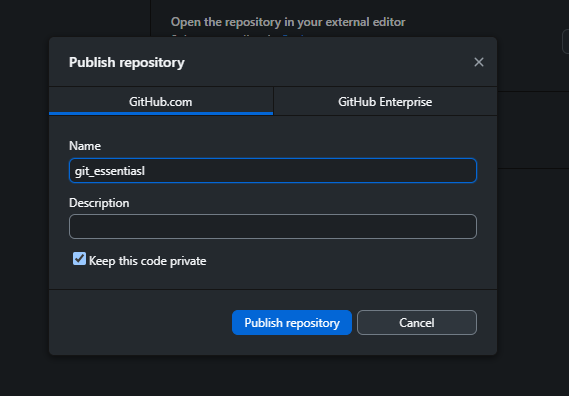

7. Verificamos el listado de repositorios de nuestro github y veremos que se ha creado correctamente, con el historial de cambios que ya teniamos y codigo

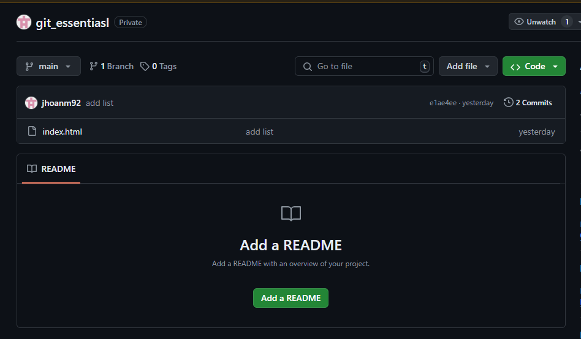

8. Desde github desktop crearemos una rama donde agregaremos primero el readme.md, despues en un nuevo commit el .gitignore donde crearemos un .env

## .env
```
    ## Run Locally

    Clone the project

    ```bash
    git clone https://link-to-project
    ```

    Go to the project directory

    ```bash
    cd my-project
    ```

    Install dependencies

    ```bash
    npm install
    ```

    Start the server

    ```bash
    npm run start
    ```
```

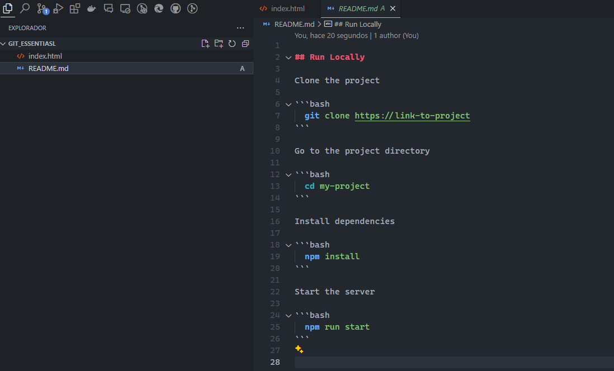

Creamo el archivo readme y agregamos el contenido que deseemos

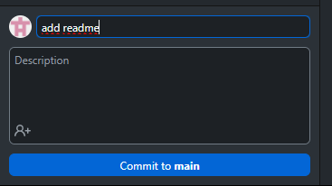

Hacemos commit del archivo agregado y hacemos click en "Commit to main"

## .gitingore

```
    .env
```

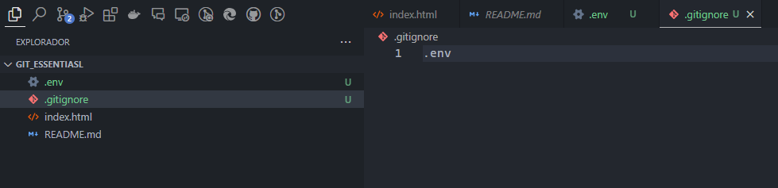

creamos los archivos .env el cual puede ir y el gitnore den esteblecemos la ruta del .env

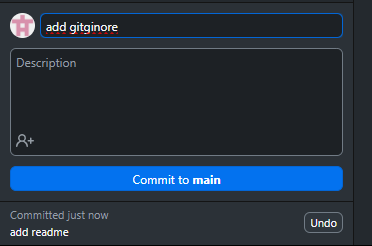

Notaremos que el .env ya sera seguido por git, por lo que procedemos a hacer commit del gitgnore

9. Ahora con el boton con el cual anteriormente realizamos la subida del repositorio, haremos la subida de los cambios hechos

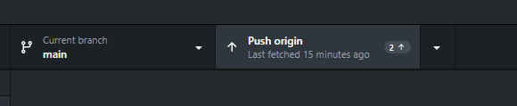

De esta forma si revisamos el repositorio remoto notaremos que el readme y gitignore fueron cargados, pero que el .env fue ignorado

10. Crearemos una nueva rama


Establcemos el nombre a la rama

11. Haremos nuevos cambios al archivo html y haremos commit de estos

```
    <!DOCTYPE html>
    <html lang="en">
    <head>
        <meta charset="UTF-8">
        <meta name="viewport" content="width=device-width, initial-scale=1.0">
        <title>Document</title>
    </head>
    <body>
        <h1>Usando Git</h1>

        <br>

        <h2>Tecnologias</h2>

        <ul>
            <li>HTML</li>
            <li>CSS</li>
            <li>JavaScript</li>
            <li>PHP</li>
        </ul>

        <h2>Otro cambio desde la rama creada con github desktop</h2>
    </body>
</html>
```

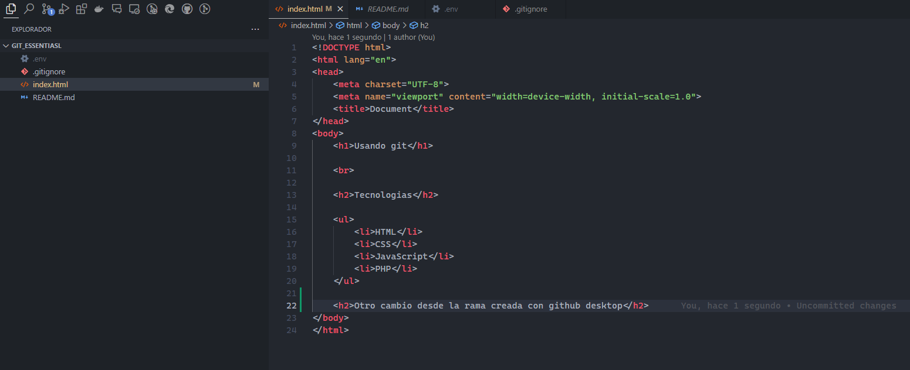

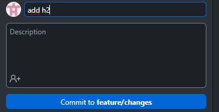

Hacemos commit de los cambios

12. Publicamos la rama con sus cambios


Esto hara que en github en la seccion de ramas aparezaca la rama en la que estabamos trabajando

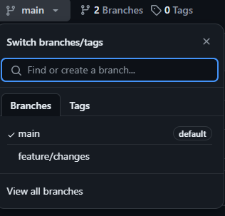

13. Procedemos a hacer un pull request desde la web de github


Ingresamo al apartado de pull request y damos click a "New Pull Request"

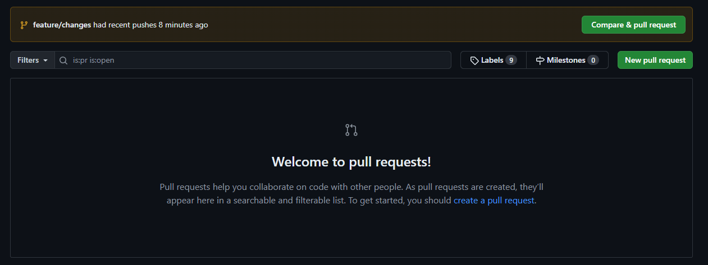

En el select "compare" seleccionamos la rama en la que trabajamos, esta sera la rama que se unira con nuestra rama principal, damos a "Create pull request"

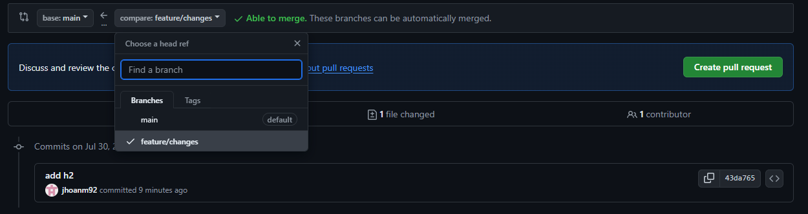

Agregamos informacion adicional, como cambiar el nombre del pull request y una descripcion, damos click a "Create pull request"

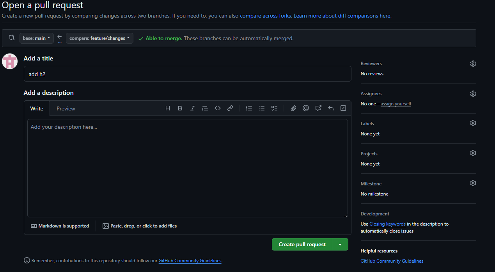

Desde aqui se podra verificar si el cambio fue aprovado si han comentadao sugerencia y quienes lo hiciero, damos a "Merge pull request" y "Confirm merge"

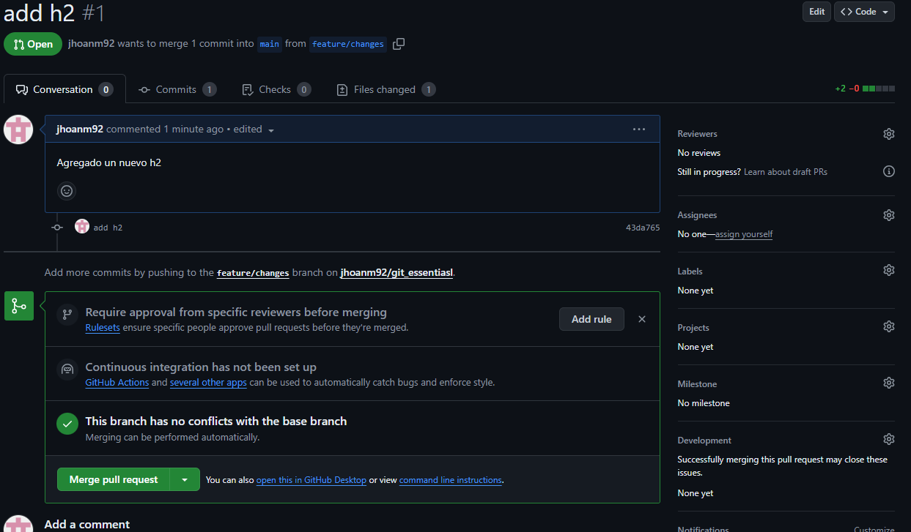

Una vez hecho el merge del pull request podemos eliminar la rama si no se seguira trabajando con ella

14. Volvemos al github desktop y vamos a bajar los cambios hechos por el merge request

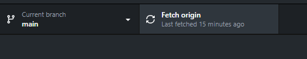

Nos aseguramos que estamos en la rama main y desde el mismo boton donde hicimos subida de repo  y cambios, haremos click pero esta vez verificara si hay cambios por bajar que no tengamos en nuestro local.

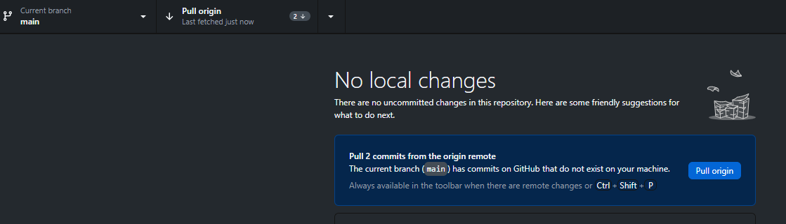

Podemos ver que da nos dice que hay dos cambios pendientes por bajar, si recuedan hicimos un commit en la anterior rama, el otro haria referencia a la union del codigo por el merge request le damos click esto bajara los cambios.

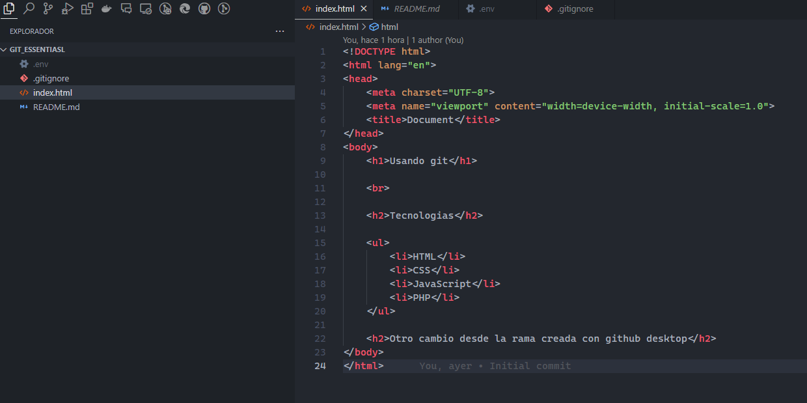

Desde el editor podemos ver que todos los cambios que hicimos en la rama anterior se unificarron


