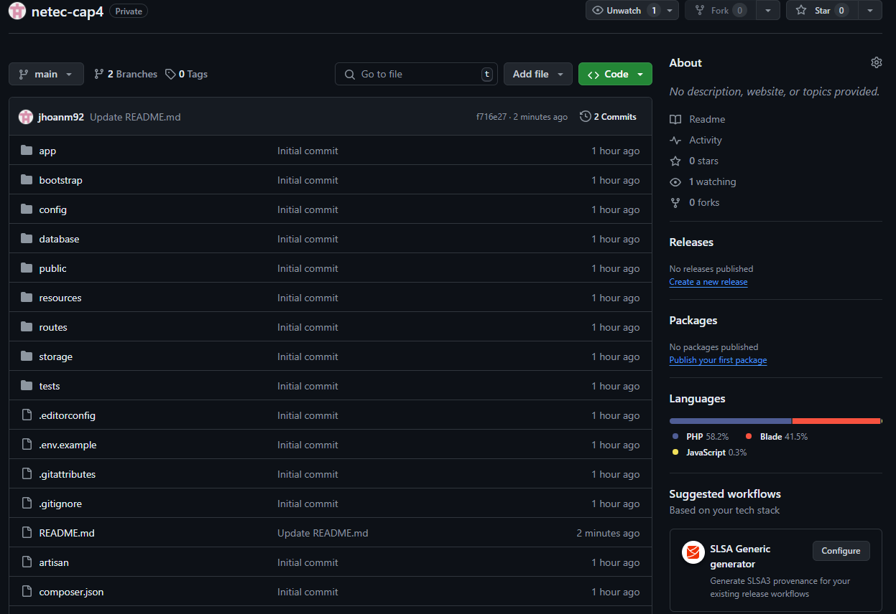
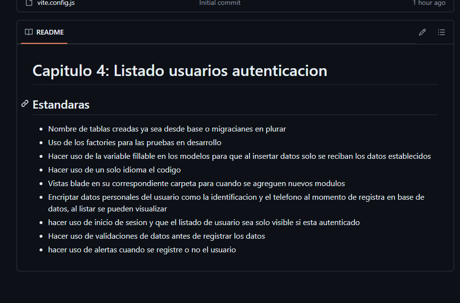
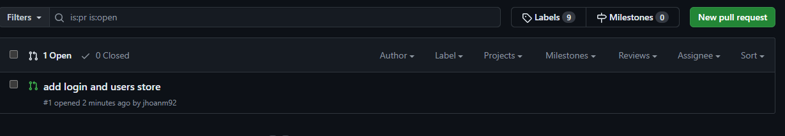
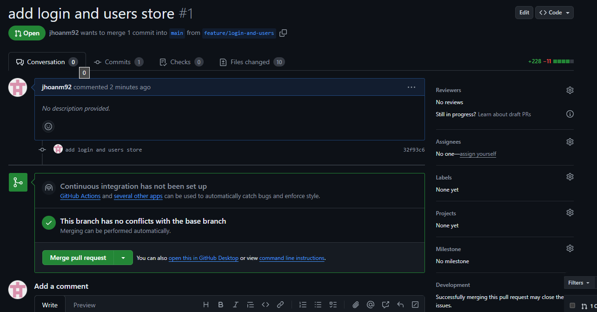
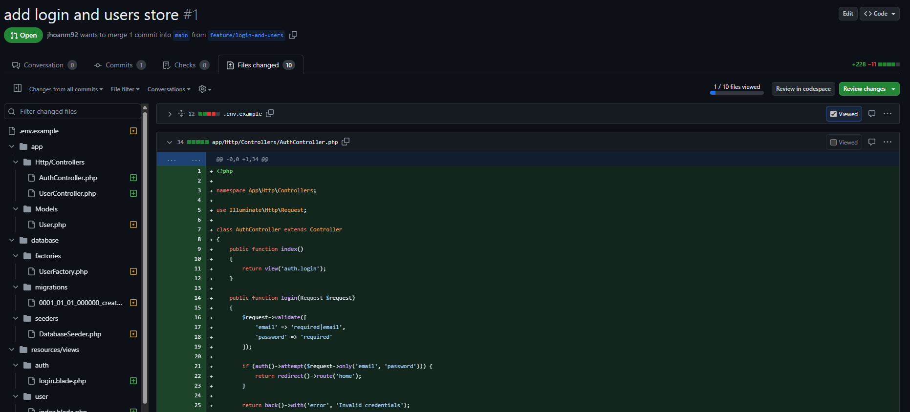

# Capitulo 4: ¿Por qué la revisión del código es crítica?

## Objetivo

* Identificar en el codigo problemas o errores de acuerdo a los estandares establecidos a seguir

## Instrucciones

1. Acceder al repositorio para la actividad del capitulo

En el readme se podra visualizar una lista de estandares a seguir en el codigo

2. Ingresar a la seccion de pull request

Seleccionar el pull request activo

3. En la seccion de "files changed" revisar los archivos modificados para ver si cumplen con los estandares establecidos

4.  Identificar los errores encontrados ya sea que no cumplen con los estandares establecidos y de seguridad de datos

5.  En un documento establecer si aprobaria el pull request, de no ser asi comentar los motivos, señalar en donde no se cumplio los estandares y como esto podria afectar la seguridad de la informacion y tambien la calidad del codigo

