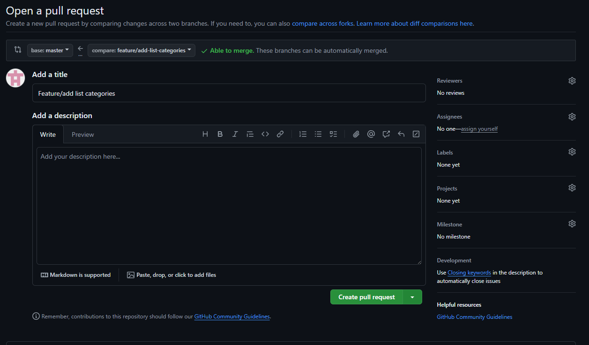

# Capitulo 5: ¿Cómo se realiza una revisión del código?

## Objetivo

* Bajar un repositorio remoto
* Subir repositorio remoto a su cuenta de github
* Crear pull requests
* Revisar codigo segun los estandares definido y comentar de ser necesario
* Aprobar pull request si se cumple con los estandares definidos

## Repositorio

[Netec cap5](https://github.com/mfperdomo09/netec-cap5.git)   

## Instrucciones

1. Clonar el repositorio en nuestro equipo en local

Copiamos la url del repositorio

En la terminal escribimos "git clone url_repositorio" clonara todo el proyecto

2. Agregamo el repositorio clonado a la herramienta de github desktop

Ya que es un repositorio inicializado lo hacecmos desde "Add existing repository" de esta forma se conservaran los commits y ramas que hay

Buscamos la ruta donde clonamos en el repositorio

Cambiamos entre ramas para que se guarden en el local

3. Ahora vamos a remover el enlace remoto de este repositorio de la cuenta que se bajo, esto con el fin de que lo podamos subir a nuestra cuenta

Primero usamos el comando "git branch" para verificacar que las ramas ya se cargan desde el local

Luego usamos el comando "git remote -v" para verificar el nombre de la conexion con la otra cuenta en este caso origin, despues "git remote remove origin" para quitar la conexion

Luego usamos nuevamente el comando "git branch y podemos ver que las ramas persiten"

Volvemos a github desktop y vemos que se nos hanilito la opcion de publicar repositorio, lo publicamos

Cambiamos el nombre y agregamos descripcion si se desea y damos click a "Publish repository"

4.  Ahora desde nuestra cuenta de github ingresamos al repositorio

Vemos que se subieron las ramas y estan listas para hacer pull request

5.  Creamos el pull request para cada una de las ramas

Ingresamos a la seccion de pull request y damos a "New Pull request"

Seleccionamos la rama

Damos click a "Create pull request" despues de seleccionar la rama

Damos click a "create pull request"

6. Hacemos la revision del codigo segun los estandares definidos en el readme

Desde la seccion de "Files chnaged" podremos visualizar los cambios los cambios propuestos para el pull request que iran a nuestra rama principal.

Al encontrar algo que no valla bien seleccionaremos la linea y escribiremos el comentarios correspondiente, agregando la posible mejora y el por que no esta cumpliendo, se dara click a "Start review"

Cuando finalice la review en este caso si la pull request no cumple con los estandares daremos click a "Review changes" para que nuestros comentarios sean publicados y finalmente damos a "Submit review"

En caso de que el pull request cumpla, en la seccion de "Comments" iremos a la secion aprobacion y daremos click a "Merge pull request" para iniciar el proceso de unificacion de cambios

Damos a click "Confirm merge", con esto finalizaria el proceso de revision.

