# Capitulo 6: Programación en pares

## Objetivo

* Simular un trabajo de desarrollo en pares haciendo uso de laravel, el instructor hara de navegante y el estudiante como conductor quien llavara a cabo el desarrollo

## Tiempo Aproximado: 26 mins

## Instrucciones

1. Primero desde laragon iniciamos los servicios de mysql para base de datos y apache


2. Desde la terminal en la carpeta www correspondiente a laragon ejecutamos el siguiente comando de composer "composer create-project laravel/laravel nombre-poryecto", esperamos hasta que finalice.

        composer create-project laravel/laravel nombre_proyecto


3. Ingresamos al proyecto y dentro del archivo .env descomentamos las lineas 23 a 27, en la linea 22 cambiamos el valor a mysql

## .env
```
    DB_CONNECTION=mysql
    DB_HOST=localhost
    DB_PORT=3306
    DB_DATABASE=laravel
    DB_USERNAME=root
    DB_PASSWORD=
```

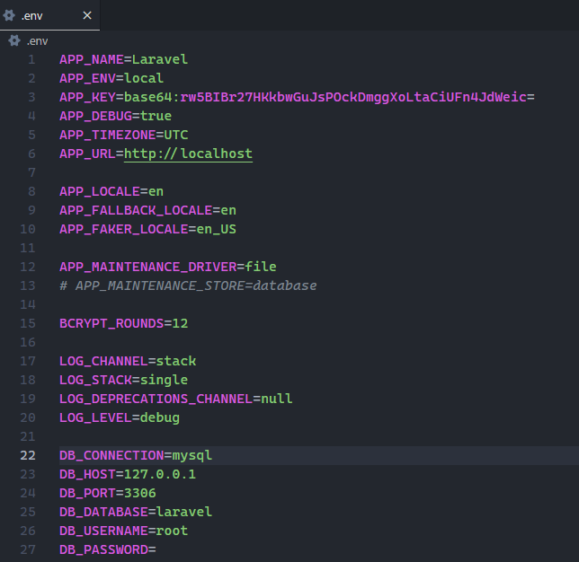

4.  En github desktop agremamos el proyecto


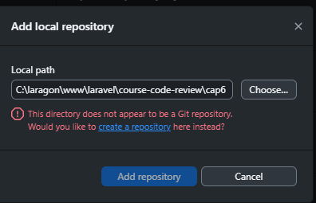

Como es proyecto no se inicializo en git vamos a dar click en "create a repository"

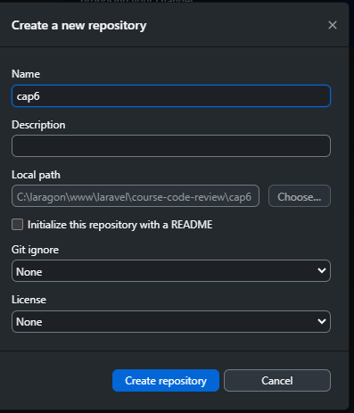

Establecemos la informacion necesaria, en este caso con solo el nombre es sufuciente

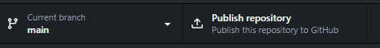

Ya agregado podemos publicar el repositorio en nuestra cuenta

5.  En la terminal ingresamos el comando "php artisan serve"

        php artisan serve

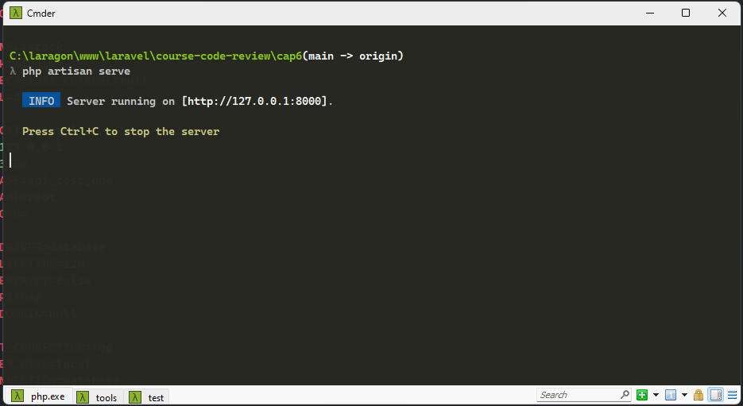

Esto hara que se inicie un servicio local donde podremos hacer uso de la url que nos genera, dando "ctrl + click" a este nos abrira el nagedor y permitira visualizar la presentacion de laravel

6. Dentro del proyecto buscamos el archivo "UserFactory" en la ruta "database/factories"

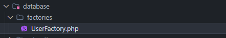

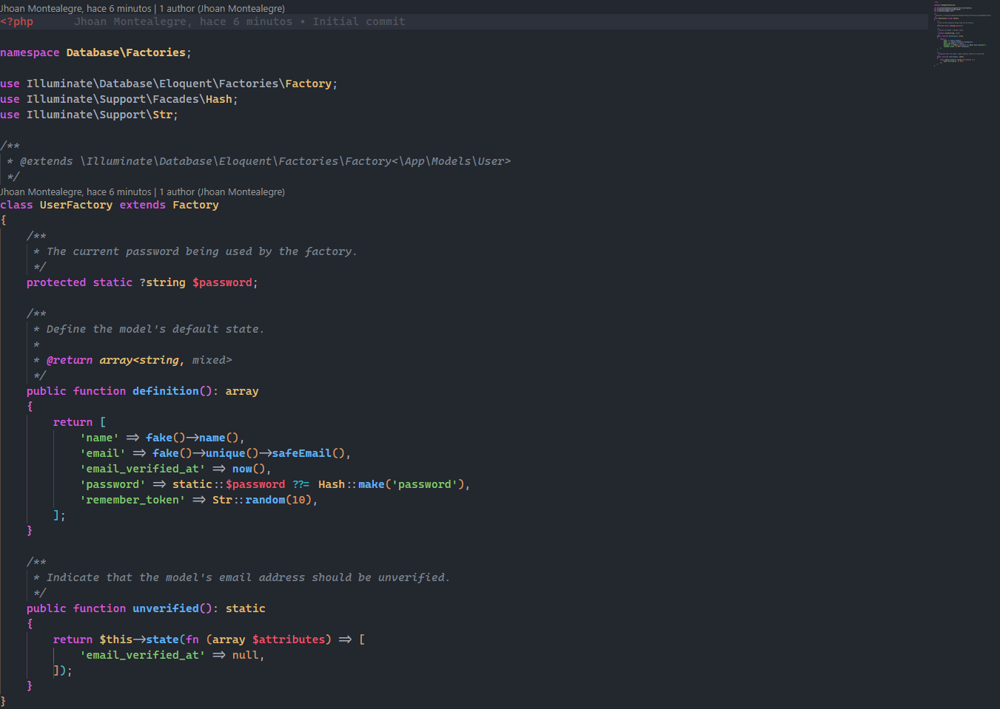

Verificamos que el codigo sea el mismo, esto con el fin para generar datos de prueba en la base de datos

7. Ahora en la ruta "database/seeders" bucamos el archivo "DatabaseSeeder.php"

## DatabaseSeeder.php
```
    <?php

    namespace Database\Seeders;

    use App\Models\User;
    // use Illuminate\Database\Console\Seeds\WithoutModelEvents;
    use Illuminate\Database\Seeder;

    class DatabaseSeeder extends Seeder
    {
        /**
         * Seed the application's database.
         */
        public function run(): void
        {
            User::factory(10)->create();
        }
    }
```

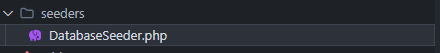

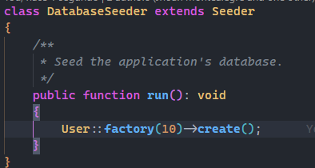

Descomentamos la linea User::Factory y elinamos el restos

8. Corremos las migraciones con los seeders para crear la base de datos e insertar los datos "php artisan migrate --seed"

        php artisan migrate --seed
Al ser la primera vez con este proyecto nos preguntara si creamos una base de datos ya que no existe, damos:

        yes

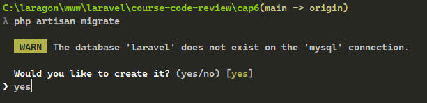

Nos preguntara si queremos crear la base de datos, escibimos "yes" y damos enter

9. Hacemos commit de los cambios y push para que suban al repositorio remoto

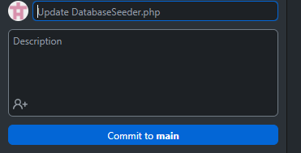

10. Creamos una rama donde crearemos un listado de los usuarios

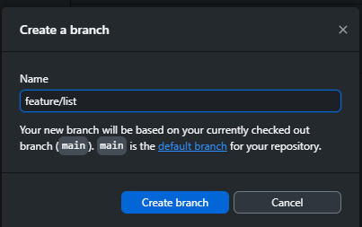

Despues de creada la publicamos


11. Usamos el comando "php artisan make:controller UserController", esto creara un archivo controllador en la ruta "app/Http/Controllers"
donde podremos crear los metodos correspondientes.

        php artisan make:controller UserController


12. En el archivo contrlador que creamos, escribiremos el metodo index, donde primero traemos todos los registros de la tabla usuario, luego retonamos la vista la cual estaria en la ruta "views/user/" junto con todo los registro de usuarios

```
    <?php

    namespace App\Http\Controllers;

    use App\Models\User;
    use Illuminate\Http\Request;

    class UserController extends Controller
    {
        public function index()
        {
            $users = User::all();

            return view('user.index', compact('users'));
        }
    }
```

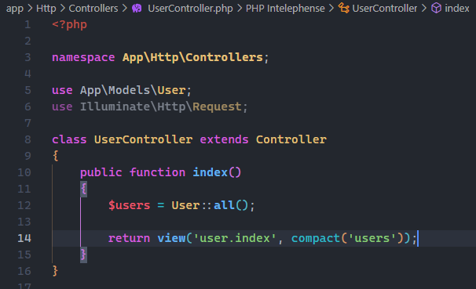

13. Ahora ingresamos al archivo "web.php" el cual es el archivo de rutas o urls de accesso que generamos.

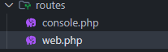

```
    Route::get('/', [UserController::class, 'index']);
```

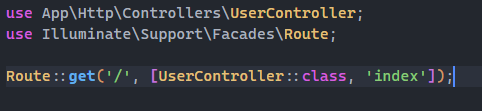

La ruta que se encuentra ahi, lo moficaremos para que no reciba una funcion si no un array con dos items, primero el controlador de usuario y el metodo que llamara esa ruta, en este caso el metodo index

14. Luego en la ruta de carpetas "resource/views/" creamos una carpeta "user" y dentro un archivo llamado "index.blade.php".

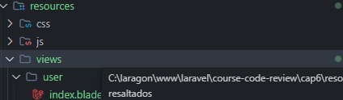

De esta foma vemos que concuerda con la ruta que establecimos en el controlador "user.index"

15. En el archivo index, crearremos la siguiente estructura html5 donde por medio de un foreach recorreremos la coleccion de registros que enviamos del controlador

## views/user/index.blade.php
```
    <!DOCTYPE html>
    <html lang="en">
    <head>
        <meta charset="UTF-8">
        <meta name="viewport" content="width=device-width, initial-scale=1.0">
        <meta http-equiv="X-UA-Compatible" content="ie=edge">
        <title>Users</title>
    </head>
    <body>
    
        <h1>User List</h1>
    
        <br>
        <br>
    
        <table>
            <thead>
                <tr>
                    <th>ID</th>
                    <th>Name</th>
                    <th>Email</th>
                    <th>Created At</th>
                    <th>Updated At</th>
                </tr>
            </thead>
    
            <tbody>
                @foreach ($users as $user)
                    <tr>
                        <td>{{$user->id}}</td>
                        <td>{{$user->name}}</td>
                        <td>{{$user->email}}</td>
                        <td>{{$user->created_at}}</td>
                        <td>{{$user->updated_at}}</td>
                    </tr>
                @endforeach
            </tbody>
        </table>
    
    </body>
    </html>
```


16. Ahora desde el navegador recargamos la pagina y vemos que nos carga el listado de usuarios registrados


