# Capitulo 7: Configuracion herramienta revision de codigo

## Objetivo

* Crear un regla que proteja nuestra rama principal, en la cual sea necesario: revisar el codigo, resolver comentarios para poder hacer el merge.

* Agregar colaboradores a nuestro, con un compañero nos daremos permisos a el repositorio, por lo que nuestro compañero tendra acceso a nuestro repositorio y nosotros al de nuestro compañero

## Instrucciones

1. Invitaremos como colaborador a uno de nuestros compañeros

Ingresamos al apartodo "settings" de nuestro repositorio y damos click a "Collaborators"

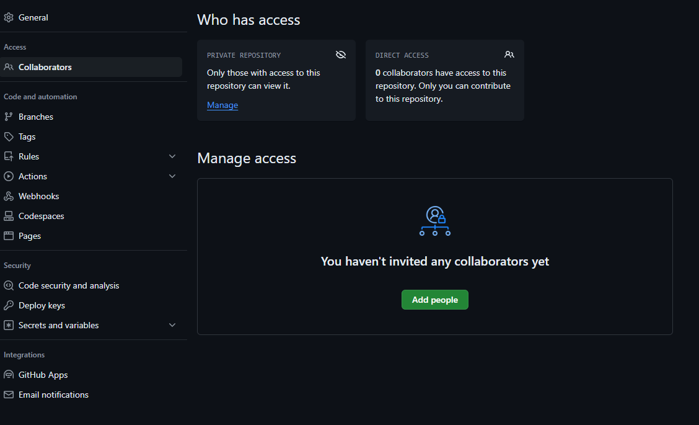

Damos click a "Add peoplo"

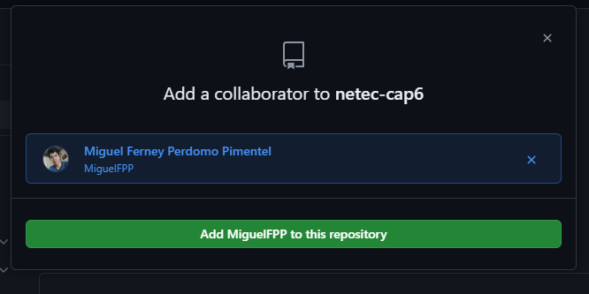

Buscamos el nombre de usuario github de nuestro compañero, lo seleccionamos y agregamos dando click "Add 'user' to this repository"

A nuestro compañero le llegara una email al correo de su cuenta de github el cual debera aceptar para poder ingresar al repo

2. Nuestro compañero clonara el repositorio en su maquina y lo agregara en github desktop

3. Ya que nuestro compañero tiene acceso como colaborador, podra hacer cambios, primero crear una rama y publicarla

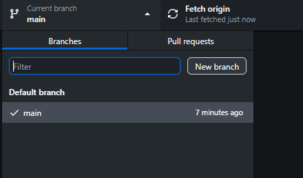

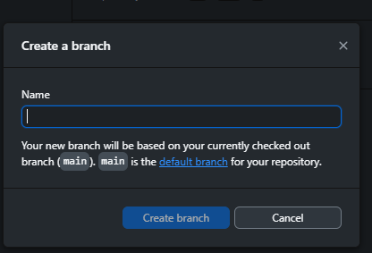

Nombre a la rama

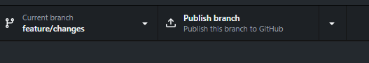

Publicar la rama

4.  Una vez creada la rama en el editor de codigo buscar el archivo "resource/views/user/index.blade.php", para realizar una pequeña modificacion, y hacer commit y push para que este en el remoto.

5.  Despues haremos pull request a la rama principal del repo que nos dieron acceso.

6. El dueño del repositorio podra visualizar el pull request y aprobarlo, dando por finalizada esta primera parte.

7. Como segunda parte, el dueño de cada repositorio creara una regla para la rama principal, esto con el fin de limitar las pull request a la rama principal

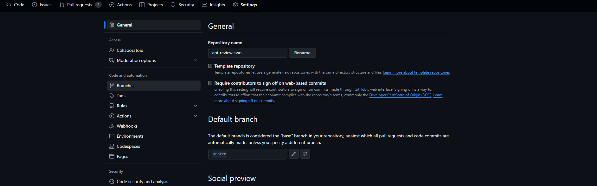

En la seccion de "setting" del repositorio, daremos click a "Branchs"

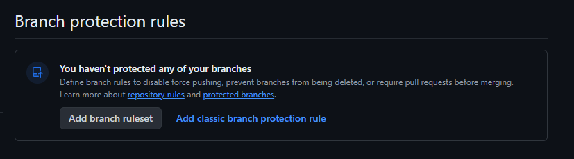

Luego al boton "Add classic branch protection rule", aqui podremos las opciones de configuracion para las ramas

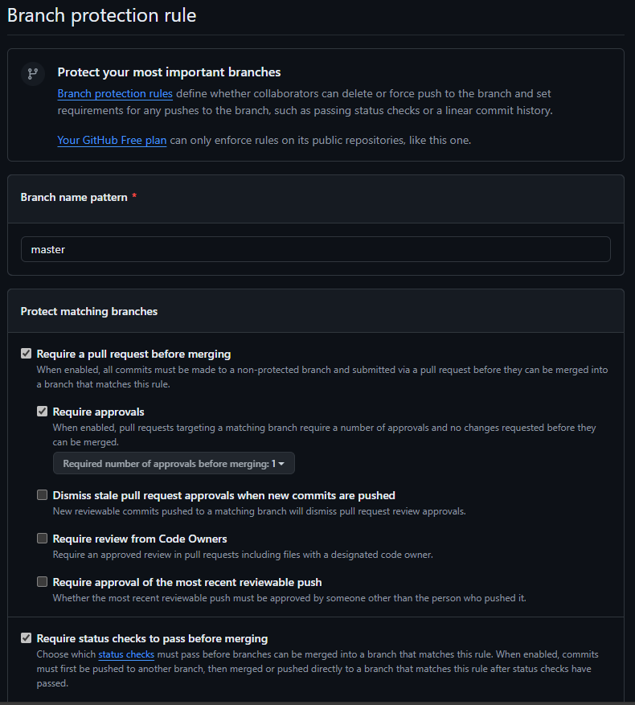

* Luego en la nueva vista, escribimos la rama que queremos proteger, en este caso "master"
* Seleccionamos "Require pull request before mergin", esto hara que sea necesario si o si una pull request para hacer merge con la rama principal
* "Require approvals" en este caso seleccionamos 1, tener en cuenta que aplica solo si no hay cambios pendientes en la revision

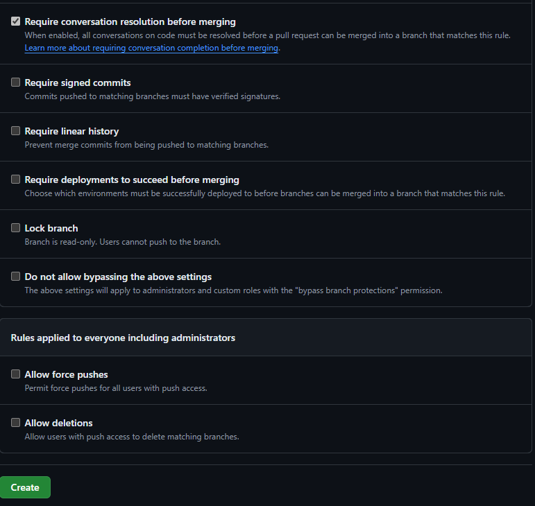

* "Require conversation resolition before merging", con esta opcion es obligatorio que todas la solicitudes hechas por el revisor en lineas de codigo sean resueltas

Finalmente se da click a "Create"

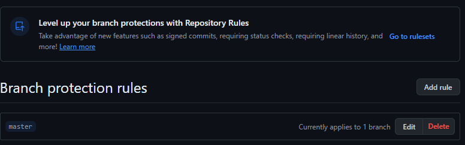

Esto nos llevara nuevamente a la configuracion de las ramas, donde vemos que se a aplicado una regla.

8. Ahora que ya aplicamos una regla para nuestra rama, nuestro compañero que tiene acceso a nuestro repositorio, creara una rama en la que hara cambios simulando un error y hara pull request de este cambio.

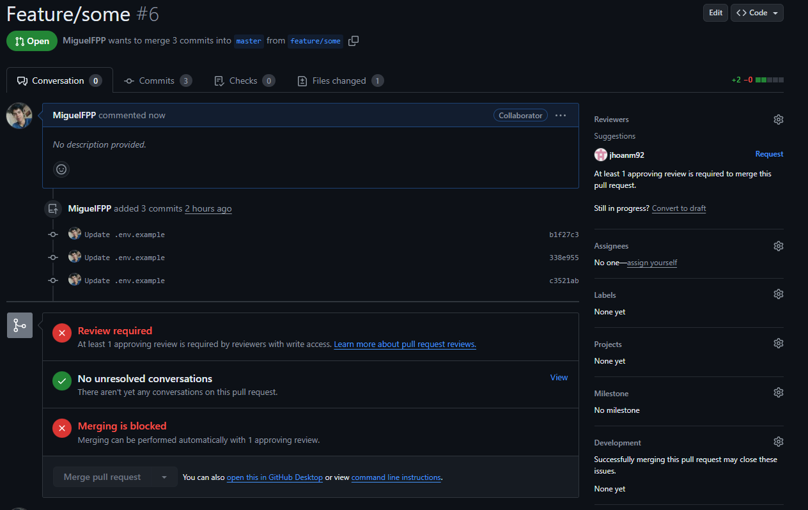

Ahora notaremos nostros como autor del cambio que no podemos aprobar el pull request y en la seccion de reviewers esta seleccionado por defecto el dueño del repositorio, por lo que es necesario de la aprobacion de el

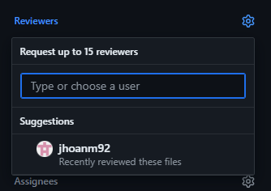

En caso de haber mas miembros de equipo podriamos cambiar el reviewer o agregar a otros

Por lo que en este momento debemos esperar a que nuestro compañero dueño del repositorio haga su revision

9. El dueño del repositorio hara la revision desde "file changed", este caso como se busca simular un error, se debera comentar el fragmento de codigo y enviar la revision

El dueño del repositorio, comentara el fragmento de codigo que simula como error

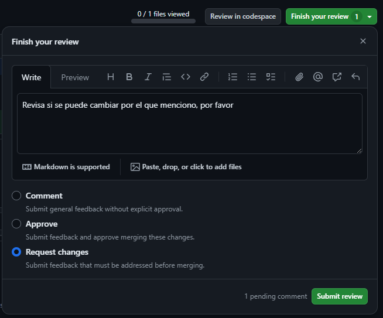

Despues finalizara la revision agregando un comentario y seleccionando la opcion de "request changes", haciendo referencia a solicitud de cambios, finalmente dando click a "Submit review"

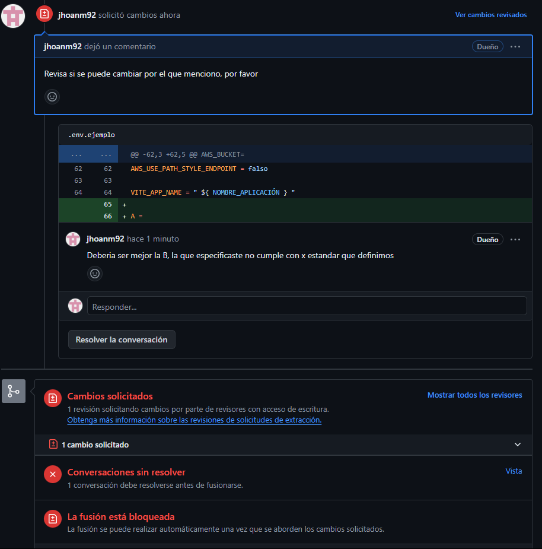

Ahora veremos en la seccion "comments" que ahora la seccion de "No unresolved conversations", ya no es valida como al inicio ya que tambien hay cambios pendiente.

Por lo que se tendra que resolver dicho cambio, para poder marcar la revision como aprobada y asi hacer el merge.

10. El autor del cambio, ahora desde local tendra que cambiar la linea solicitada y hacer push de ese cambio.

11. El autor del cambio, en la seccion de comentarios comentara que esta listo y lo marcara como resuelto desde "Resolve conversation"

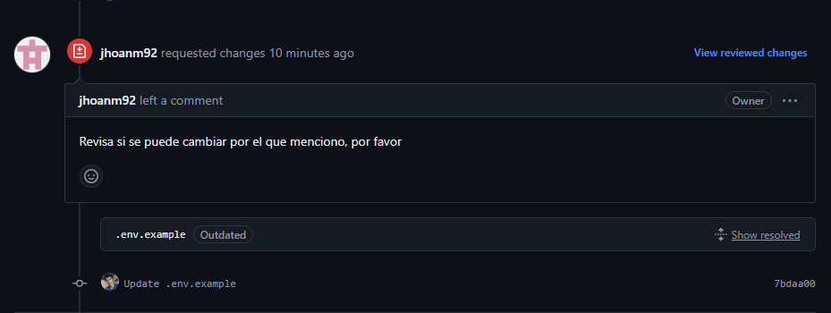

De esta forma cerraremos la solicitud de cambios

11. Una vez que este el cambio solicitado, el dueño del repo podra verificar desde "files changed" nuevamente, y en este caso aprobar el pull request.

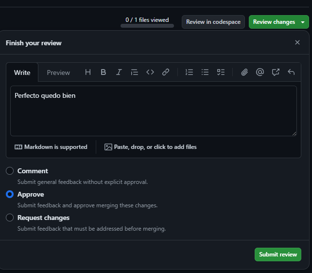

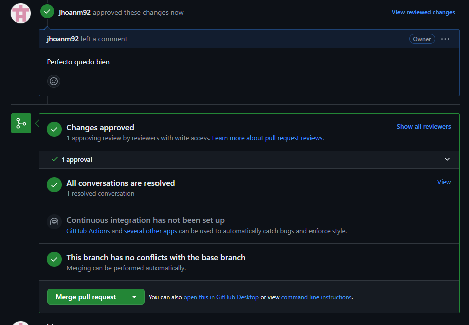

Y notaremos tanto autor como dueño, que ya estan habilitadas las opciones de merge, por que se resolvio la solicitud de cambios, y se aprobo el pull request desde la revision.

12. Ya que se aprobo ya sea el dueño o el autor de los cambios podra hacer el merge para unificar los cambios con la rama principal

* Cabe recalcar que todo este proceso de solicitud de cambios sera notificado en las cuentas de correo, las solicitudes de cambio, los comentarios y la aprobacion.

